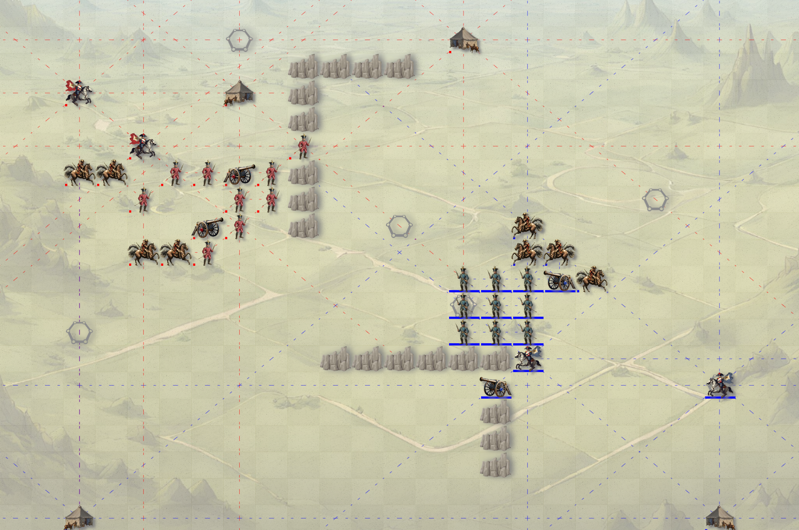

> sbt fastOptJS

A Game of War is a book by Guy Debord and Alice Becker-Ho that illustrates a game devised by Debord by giving a detailed account of one of their table-top conflicts1. Originally published in French as Le Jeu de la Guerre in 1987, the book provides insights into Debord’s strategic thinking and approach to war.

In this unique game, Debord aimed to represent the essential movements of war on a relatively simple game board. Here are some key points about A Game of War:

Game Basics:
The game is somewhat similar to chess, as it revolves around war and strategy.
Two players take turns moving troops across the board.
Each player can move up to 5 troops per turn and is allowed 1 attack.
Attacking involves summing up the offensive power of all pieces within range of an enemy target square and subtracting the total defensive power of the opponent. If the result is greater than 2, the attack succeeds.
The game board includes natural obstructions that simulate different terrains on a battlefield.
Winning Conditions:
The winner can achieve victory by either defeating all the opponent’s troops or destroying their arsenals.
Limitations:
Debord acknowledged that there were three factors preventing the game from being 100% accurate:
Climate conditions and the cycles of day and night.
The influence of troop morale.
Uncertainty about the exact positions and movements of the enemy.
Legacy and Reception:
Although the game and the book did not receive widespread success, copies are still available today.
London-based group Class Wargames has reproduced A Game of War and taken it on a campaign around the globe, playing it in various locations1.
Debord’s reflections on war and strategy through this game offer a unique perspective, and it remains an intriguing piece of intellectual exploration2. If you’re interested in strategic games, A Game of War might be worth exploring further!
